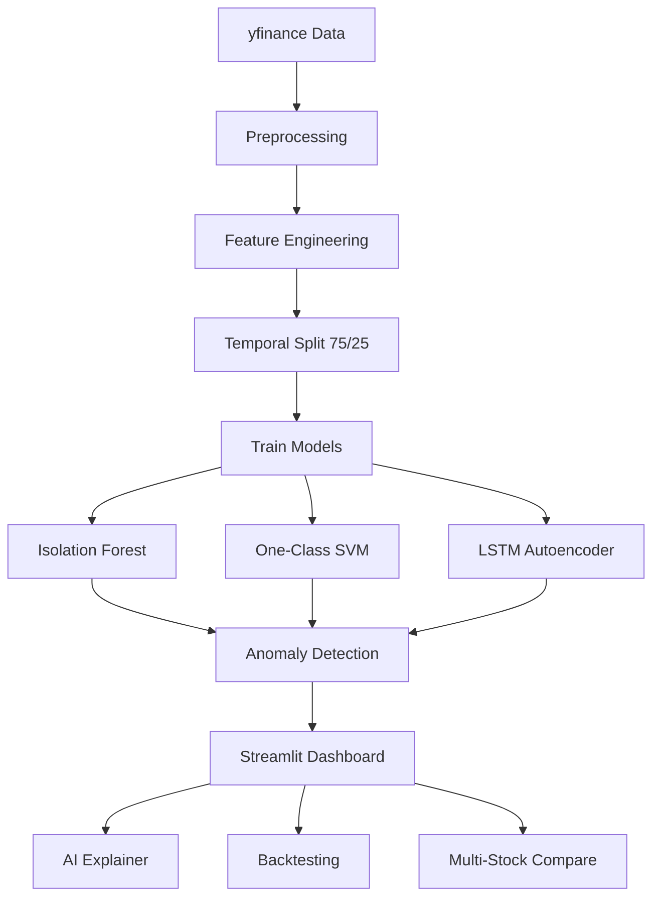

# Stock Anomaly AI 📈


Stock Anomaly AI detects unusual market behavior from OHLCV data using a strict temporal split (75% train, 25% test) to avoid look-ahead bias. It combines Isolation Forest, One-Class SVM, and an LSTM Autoencoder with interactive explainability, multi-stock comparison, and educational backtesting.

## Architecture



## Features

- 📊 Interactive Streamlit dashboard with 8 analysis tabs
- 🧠 Three anomaly models: Isolation Forest, One-Class SVM, LSTM Autoencoder
- 🔎 AI anomaly explainer with feature-level reason codes and severity badge
- 📈 Technical indicators: RSI, MACD, Bollinger Bands, volatility
- 🧪 Backtesting simulation (educational) vs buy-and-hold baseline
- 🏷️ Multi-stock comparison with anomaly rates and return correlation heatmap

## How To Run Locally

```bash
python -m venv .venv
.venv\Scripts\activate
pip install -r requirements.txt
streamlit run app/streamlit_app.py
```

## How To Run With Docker

```bash
docker build -t stock-anomaly-ai .
docker run --rm -p 8501:8501 stock-anomaly-ai
```

## Project Structure

```text
stock-anomaly-ai/
├── app/
│   └── streamlit_app.py
├── src/
│   ├── anomaly_detection.py
│   ├── backtesting.py
│   ├── config.py
│   ├── data_collection.py
│   ├── explainer.py
│   ├── explainability.py
│   ├── feature_engineering.py
│   ├── lstm_autoencoder.py
│   ├── model_training.py
│   ├── pipeline.py
│   ├── preprocessing.py
│   ├── utils.py
│   └── visualization.py
├── data/
├── models/
├── outputs/
├── Dockerfile
├── requirements.txt
└── README.md
```

## Limitations

- Educational tool only; not financial advice or a production trading system.
- Backtesting is simplified and excludes slippage, fees, and market impact.
- Unsupervised anomalies are statistical outliers, not guaranteed trade signals.
- LSTM model availability depends on TensorFlow installation/runtime.

## Tech Stack

- Python, pandas, numpy, scikit-learn, TensorFlow/Keras
- Streamlit, Plotly, matplotlib
- yfinance, joblib, Docker
