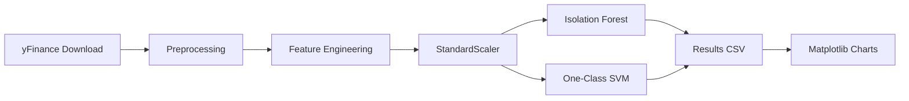

# Stock Anomaly AI

Production-style Python pipeline for **unsupervised stock price anomaly detection** using **Isolation Forest** and **One-Class SVM**. Built for portfolio showcase, recruiter review, and future **Streamlit** deployment.


---

## Overview

This project downloads historical OHLCV data via **yFinance**, engineers technical features (returns, moving averages, volatility, volume change), trains two complementary anomaly detectors, and exports labeled results with visualizations.

| Component | Technology |
|-----------|------------|
| Data source | yFinance |
| Feature engineering | Pandas / NumPy |
| Models | Isolation Forest, One-Class SVM |
| Scaling | StandardScaler |
| Persistence | joblib, CSV |
| Visualization | Matplotlib |
| UI (optional) | Streamlit |

---

## Project Structure

```
stock-anomaly-ai/
├── data/
│   ├── raw/              # Downloaded OHLCV (stock_raw.csv)
│   └── processed/        # Cleaned data (stock_processed.csv)
├── models/               # Trained scaler + models (.joblib)
├── outputs/              # Results CSV + chart PNGs
├── src/
│   ├── config.py         # Paths, hyperparameters, feature list
│   ├── data_collection.py
│   ├── preprocessing.py
│   ├── feature_engineering.py
│   ├── model_training.py
│   ├── anomaly_detection.py
│   ├── visualization.py
│   └── utils.py
├── app/
│   └── streamlit_app.py  # Interactive dashboard stub
├── main.py               # CLI pipeline entry point
├── requirements.txt
├── .gitignore
└── README.md
```

---

## Quick Start

### 1. Clone and enter the project

```bash
cd stock-anomaly-ai
```

### 2. Create a virtual environment (recommended)

```bash
python -m venv venv
# Windows
venv\Scripts\activate
# macOS / Linux
source venv/bin/activate
```

### 3. Install dependencies

```bash
pip install -r requirements.txt
```

### 4. Run the pipeline

```bash
python main.py
```

Custom ticker and date range:

```bash
python main.py --symbol MSFT --start 2019-01-01 --end 2023-12-31
```

Save plots to `outputs/` without displaying:

```bash
python main.py --no-plots --save-plots
```

---

## Pipeline Flow



1. **Data collection** — Download OHLCV → `data/raw/stock_raw.csv`
2. **Preprocessing** — Drop NaNs, normalize dates → `data/processed/stock_processed.csv`
3. **Feature engineering** — Returns, MAs, volatility, volume change
4. **Training** — Fit scaler + both models → `models/*.joblib`
5. **Detection** — Binary anomaly flags → `outputs/stock_anomaly_results.csv`
6. **Visualization** — Price charts with anomaly markers

---

## Features Used for Detection

| Feature | Description |
|---------|-------------|
| `Daily_Return` | Daily % change in close price |
| `MA_10` / `MA_20` | 10- and 20-day moving averages |
| `Volatility` | 10-day rolling std of close |
| `Rolling_STD` | 5-day rolling std of close |
| `Volume_Change` | Daily % change in volume |

Hyperparameters live in `src/config.py` and can be tuned without changing pipeline logic.

---

## Streamlit Dashboard (Optional)

```bash
pip install streamlit
streamlit run app/streamlit_app.py
```

Use the sidebar to set ticker, date range, and run the full pipeline interactively.

---

## Outputs

| Artifact | Location |
|----------|----------|
| Raw data | `data/raw/stock_raw.csv` |
| Processed data | `data/processed/stock_processed.csv` |
| Trained models | `models/isolation_forest.joblib`, `models/one_class_svm.joblib`, `models/feature_scaler.joblib` |
| Results | `outputs/stock_anomaly_results.csv` |
| Charts (optional) | `outputs/iso_anomaly_chart.png`, `outputs/svm_anomaly_chart.png` |

Results CSV includes original OHLCV, engineered features, and `Iso_Anomaly` / `SVM_Anomaly` columns (`1` = anomaly, `0` = normal).

---

## Design Decisions

- **Modular `src/` package** — Each stage is a separate module with typed functions and docstrings for testability and reuse.
- **Centralized config** — Paths and model params in one place for easy experimentation.
- **Model persistence** — joblib artifacts support inference-only runs and Streamlit reload.
- **CLI + library API** — `main.py` orchestrates the pipeline; modules can be imported independently.

---

## Future Enhancements

- [ ] Unit tests (`pytest`) for preprocessing and feature engineering
- [ ] Hyperparameter tuning (GridSearch / Optuna)
- [ ] Additional tickers and batch processing
- [ ] LSTM / autoencoder baseline for comparison
- [ ] Docker + CI workflow
- [ ] Full Streamlit charts (Plotly) and model comparison view

---

## Author

Built as an end-to-end ML portfolio project demonstrating clean architecture, unsupervised learning, and financial time-series feature engineering.

---

## License

MIT — free to use for learning and portfolio purposes.
